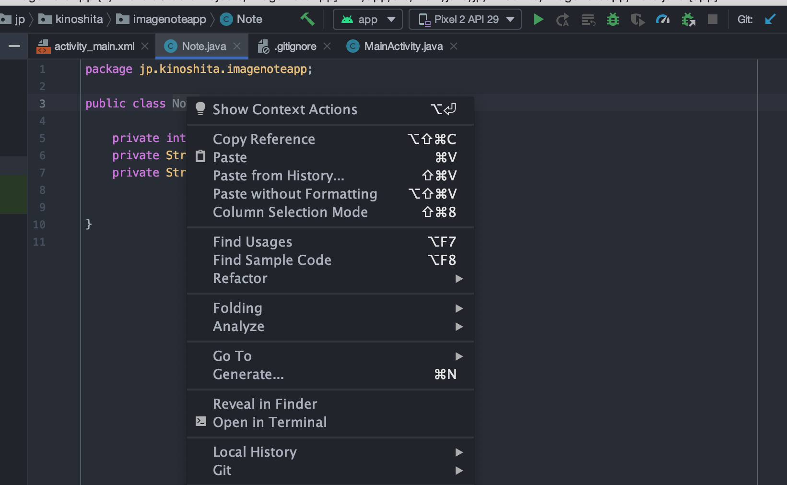

# Androidでリスト表示
Androidで一覧表示を実現するにはどうすればいいでしょうか？・・  
- LinearLayoutのaddChildメソッドを使用する
- 手動で一つずつ実装する。
- Viewを継承してonDrawで描画する。  

上記の方法でもできなくはないですが、  
**RecyclerView**を使用してお手軽にリスト表示を実現することができます。  

## RecyclerViewのユースケース
以下のような**繰り返し同じようなものを表示**(リスト表示)する場合は、  
**RecyclerView**を利用するといい感じにできるかもしれません。
- TwitterやInstagram, Misskeyのようなタイムラインを作りたい
- Todoリストを作りたい
- 何かを一覧表示したい
- 画像を一覧表示したい


## RecyclerViewじゃなくてもいいのでは？
以下の場合はRecyclerViewを使用しない方がいいかもしれません。
- 表示するものが多くてスクロールしたい  
  ScrollViewとLinearLayoutを使ってください

## 作るもの
今回は**画像とその画像のタイトルと説明を一覧表示**するアプリを作成しながら、  
**RecyclerView**の使い方を学習します。  


## プロジェクトを作成します。
Activityは**EmptyActivity**を選択します。  
**アプリ名、パッケージ名はAndroidのコード規約の範囲内で自由に設定してください。**  
例として以下の設定を使用します。  
- アプリ名:ImageNoteApp
- パッケージ名:jp.kinoshita.imagenoteapp
- minSdk: Android 6.0


## レイアウトを作成します。
TextViewは削除しておいてください。  
res/layout/activity_main.xml ファイルを開きます。  
XMLが表示されている人は以下の画像を参考に「レイアウトのプレビュー方式」から切り替えておいてください  


パレットの虫眼鏡（検索）アイコンを押して[ RecyclerView ]と検索します。  


それをレイアウトへ貼り付けます。  
何かダイアログが出てきますが**OKを選択してください**

次にレイアウトのプレビュー方式をDesignからCodeに切り替えてください。  
XMLが表示されるようになると思います。
とりあえず**androidx.recyclerview.widget.RecyclerViewが貼り付けられていればOKです。**

```
<?xml version="1.0" encoding="utf-8"?>
<androidx.constraintlayout.widget.ConstraintLayout xmlns:android="http://schemas.android.com/apk/res/android"
    xmlns:app="http://schemas.android.com/apk/res-auto"
    xmlns:tools="http://schemas.android.com/tools"
    android:layout_width="match_parent"
    android:layout_height="match_parent"
    tools:context=".MainActivity">


    <androidx.recyclerview.widget.RecyclerView
        android:layout_width="409dp"
        android:layout_height="729dp"
        tools:layout_editor_absoluteX="1dp"
        tools:layout_editor_absoluteY="1dp" />
</androidx.constraintlayout.widget.ConstraintLayout>
```

## レイアウトを細かく設定する
ここまでRecyclerViewを貼り付けることができたのでレイアウトを編集します。  
  
何をしてあげたのかというとRecyclerViewを外側(親)のレイアウトめいいっぱいに広げるという作業をしました。
```
<?xml version="1.0" encoding="utf-8"?>
<androidx.constraintlayout.widget.ConstraintLayout 
    xmlns:android="http://schemas.android.com/apk/res/android"
    xmlns:app="http://schemas.android.com/apk/res-auto"
    xmlns:tools="http://schemas.android.com/tools"
    android:layout_width="match_parent"
    android:layout_height="match_parent"
    tools:context=".MainActivity">


<androidx.recyclerview.widget.RecyclerView
    android:layout_width="0dp"
    android:layout_height="0dp"
    app:layout_constraintBottom_toBottomOf="parent"
    app:layout_constraintStart_toStartOf="parent"
    app:layout_constraintTop_toTopOf="parent"
    app:layout_constraintEnd_toEndOf="parent"
    />
</androidx.constraintlayout.widget.ConstraintLayout>
```

## RecyclerViewにidを設定する。
このままでは**Activity**から**RecyclerViewのインスタンス**を取得することができないので、RecyclerViewにidを設定してあげます。
```
android:id="@+id/notes_view"
```

とりあえずレイアウトの設定は完了しました。  
activity_main.xmlの全体像
```
<?xml version="1.0" encoding="utf-8"?>
<androidx.constraintlayout.widget.ConstraintLayout
    xmlns:android="http://schemas.android.com/apk/res/android"
    xmlns:app="http://schemas.android.com/apk/res-auto"
    xmlns:tools="http://schemas.android.com/tools"
    android:layout_width="match_parent"
    android:layout_height="match_parent"
    tools:context=".MainActivity">


<androidx.recyclerview.widget.RecyclerView
    android:id="@+id/notes_view"
    android:layout_width="0dp"
    android:layout_height="0dp"
    app:layout_constraintBottom_toBottomOf="parent"
    app:layout_constraintStart_toStartOf="parent"
    app:layout_constraintTop_toTopOf="parent"
    app:layout_constraintEnd_toEndOf="parent"
    />
</androidx.constraintlayout.widget.ConstraintLayout>
```

## Noteクラスを作成する
今回、アプリで必要なデータとして以下のものが挙げあれます。
- 画像のリソースId
- タイトル
- 本文　　
  
これらを多次元配列で扱ってもいいのですが、  
せっかくJavaのオブジェクト指向の仕様を学習したところなので活用していきます。 
「パッケージ名.アプリ名」を右クリックして  


New(新規) -> Java Classを選択します。  
  

Name: に[Note]と入力し、OKします。  
それ以外の項目はわからない場合は入力しないでください。  

Noteクラスが作成されたと思います。
```
package jp.kinoshita.imagenoteapp;

public class Note {
}
```

## Noteクラスの仕様
Noteクラスの基本的な仕様は以下のようになります

### フィールド
|アクセッサー|型|名称|説明|
|-|-|-|-|
|private|int|imageResourceId|画像のリソースIdを保持します|
|private|String|title|タイトル|
|private|String|text|本文|

  
### メソッド
|アクセッサー|戻り値|名称|引数|詳細|
|-|-|-|-|-|
|public|String|getImageResourceId|なし|imageResourceIdのgetter|
|public|String|getTitle|なし|titleのgetter|
|public|String|getText|なし|textのgetter|

### コンストラクタ
|アクセッサー|引数|
|-|-|
|public|int imageResourceId, String title, String text|

これらをもとに作成します。
## フィールドを実装
```
package jp.kinoshita.imagenoteapp;

public class Note {

    private int imageResourceId;
    private String title;
    private String text;


}
```

## getterメソッドを実装
手動で実装してもいいのですがAndroidStudioにはgetterメソッドを自動で作成してくれる機能があります。

Noteクラスを右クリックしてGenerate（生成する）を選択します。


Getterを選択します。（上から二番目）  


作成したフィールド全てを選択します。    
**Shiftキーを押しながら矢印キーを押すことで選択できます。**  


getterメソッドが生成されました。とても便利ですね！！
```
package jp.kinoshita.imagenoteapp;

public class Note {

    private int imageResourceId;
    private String title;
    private String text;


    public int getImageResourceId() {
        return imageResourceId;
    }

    public String getTitle() {
        return title;
    }

    public String getText() {
        return text;
    }
}

```

同じようにコンストラクタも生成します。  
これでNoteクラスの基本的な実装ができました。  
Note クラスの全体像は以下のようになります。
```
package jp.kinoshita.imagenoteapp;

public class Note {

    private int imageResourceId;
    private String title;
    private String text;

    public Note(int imageResourceId, String title, String text) {
        this.imageResourceId = imageResourceId;
        this.title = title;
        this.text = text;
    }


    public String getTitle() {
        return title;
    }

    public String getText() {
        return text;
    }
}

```

## 画像を取り込む
添付した画像をdrawableに入れてください。  
（間違ってdrawable-v24に入れないように！！）  
[添付ファイル](./images/)  
[添付ファイル(Zip)](./images.zip) 


## データの準備
スマホのストレージやインターネットから画像を持ってきてそれを表示するのも良かったのですが、  
  今回は予め用意したデータを表示したいと思います。


## サンプル用のデータを作成します。
以下の変数をMainActivityのフィールド（インスタンス変数）として初期化してください。  
全て入力するのは苦行なのでコピーしてください。
```
   // Noteのためのデータ(本来はストレージやネットワークからとってくる)
    private int[] imageResources = {
            R.drawable.img_1,
            R.drawable.img_2,
            R.drawable.img_3,
            R.drawable.img_4,
            R.drawable.img_5,
            R.drawable.img_6,
            R.drawable.img_7,
            R.drawable.img_8
    };

    private String[] titles = {
            "顔交換",
            "猫が仕事の邪魔をする",
            "しごとが・・",
            "猫の手も借りたい",
            "猫の手も借りたい",
            "動物用の薬",
            "猫に小判",
            "オッドアイの猫"
    };

    private String[] texts = {
            "顔交換アプリを使ったら猫と顔が交換されました",
            "猫が仕事の邪魔をして仕事が捗らない・・",
            "猫様が仕事の邪魔をして仕事が進まない、でも幸せかも・・",
            "誰か手伝ってくれないかな、猫の手でもいいから・・",
            "猫でもいいから手を貸してくれ！！",
            "最新の動物用の薬です",
            "猫に小判、使いこなせなかったら意味ないよ・・",
            "オッドアイの猫を発見しました\n神秘的！！"
    };

```

## Noteのリスト(List)を作成します
先ほど作成したサンプルデータをもとに、  
Noteインスタンスを作成して、ArrayListに追加します。  


### notesフィールドを宣言する
```
    List<Note> notes;
```

### onCreateメソッドに初期化ロジックを実装します。
notesフィールドを初期化するロジックをonCreate中に書きます。  
以下のクラスのインポートを忘れないでください
- java.util.ArrayList;
- java.util.List;

```
ArrayList<Note> list = new ArrayList<>();
        for(int i = 0; i < imageResources.length; i ++){
            
            // 作成したデータをもとにNoteを作成する
            Note note = new Note(imageResources[i], titles[i], texts[i]);
            
            // 作成したNoteをArrayListに追加する。
            list.add(note);
        }
        this.notes = list;
```

ここまでのMainActivityの全体像
[https://github.com/Kinoshita0623/ImageNoteApp/blob/master/app/src/main/java/jp/kinoshita/imagenoteapp/MainActivity.java](https://github.com/Kinoshita0623/ImageNoteApp/blob/notes%E3%81%AE%E5%88%9D%E6%9C%9F%E5%8C%96/app/src/main/java/jp/kinoshita/imagenoteapp/MainActivity.java);

---
## RecyclerViewの実装
ようやくこれからが本番です。
RecyclerViewの仕組みとしてはレイアウトを何度も使い回すことによって、効率化をしています。  
## リスト表示のレイアウトを作成する。
画像とタイトルと本文を表示するためのレイアウトを作成します。
resのlayoutを右クリックしてLayout Resource Fileを選択します。  
名前は**item_note.xml**にしました  


レイアウトは以下のようになります。  
使われているidとViewを把握さえすればコピーしてもらってもOKです。
```
<?xml version="1.0" encoding="utf-8"?>
<androidx.constraintlayout.widget.ConstraintLayout
    xmlns:android="http://schemas.android.com/apk/res/android"
    xmlns:app="http://schemas.android.com/apk/res-auto"
    xmlns:tools="http://schemas.android.com/tools"
    android:layout_width="match_parent"
    android:layout_height="wrap_content"
    android:paddingStart="8dp"
    android:paddingTop="4dp"
    android:paddingBottom="4dp"
    android:paddingEnd="8dp">

    <ImageView
        android:id="@+id/image_view"
        android:layout_width="100dp"
        android:layout_height="100dp"
        app:layout_constraintBottom_toBottomOf="parent"
        app:layout_constraintStart_toStartOf="parent"
        app:layout_constraintTop_toTopOf="parent"
        tools:srcCompat="@drawable/ic_launcher_background"
        tools:ignore="ContentDescription"
        android:scaleType="center"/>

    <TextView
        android:id="@+id/title_view"
        android:layout_width="0dp"
        android:layout_height="wrap_content"
        tools:text="タイトルが表示されます"
        app:layout_constraintEnd_toEndOf="parent"
        app:layout_constraintStart_toEndOf="@+id/image_view"
        app:layout_constraintTop_toTopOf="parent"
        android:layout_marginStart="8dp"
        android:textSize="20sp"
        android:textStyle="bold"/>

    <TextView
        android:id="@+id/text_view"
        android:layout_width="0dp"
        android:layout_height="wrap_content"
        tools:text="本文が表示されます"
        app:layout_constraintEnd_toEndOf="parent"
        app:layout_constraintStart_toEndOf="@+id/image_view"
        app:layout_constraintTop_toBottomOf="@+id/title_view"
        android:layout_marginTop="8dp"
        android:layout_marginStart="8dp"/>
</androidx.constraintlayout.widget.ConstraintLayout>
```

## Viewとそのidの関係と説明
後々使用するのでしっかりと把握してください。
|View|id|詳細|
|-|-|-|
|ImageView|image_view|画像表示用|
|TextView|title_view|タイトル表示用|
|TextView|text_view|本文表示用|


## ViewHolderを作成&実装する
ViewHolderで表示処理のための処理を行います。  
RecyclerViewの肝となる部分です。  

ItemNoteViewHolderクラスを作成してください。  
(クラスの作成方法はNoteクラスを作成した時と同じです)
```
package jp.kinoshita.imagenoteapp;

import androidx.recyclerview.widget.RecyclerView;

public class ItemNoteViewHolder extends RecyclerView.ViewHolder {
    
}

```

## フィールドを宣言します
importを忘れないようにしてください。

```
private ImageView imageView;
private TextView titleView;
private TextView textView;
```

## コンストラクタを作成します
コンストラクタはView型 viewを受け取ります。

```
public ItemNoteViewHolder(View view){
    /* 親クラスRecyclerView.ViewHolderのコンストラクタはViewを必要としている */
    super(view);

    imageView = view.findViewById(R.id.image_view);
    titleView = view.findViewById(R.id.title_view);
    textView = view.findViewById(R.id.text_view);
}
```

## onBindメソッドを作成する
ItemNoteViewHolderにonBindメソッドを作成します。
```
public void onBind(Note note){
        
}
```

## onBindメソッドを実装する
onBindメソッドでitem_viewにデータをセットします。
```
// item_noteのimage_viewにNoteに設定した画像をセットします。
imageView.setImageResource(note.getImageResourceId());

// item_noteのtitle_viewにNoteに設定したタイトルをセットしています。
titleView.setText(note.getTitle());

// item_noteのtext_viewにNoteに設定したテキスト（本文）をセットしています。
textView.setText(note.getText());
```

ItemNoteViewHolderが完成しました。
全体像
```
package jp.kinoshita.imagenoteapp;

import android.view.View;
import android.widget.ImageView;
import android.widget.TextView;

import androidx.recyclerview.widget.RecyclerView;

public class ItemNoteViewHolder extends RecyclerView.ViewHolder {
    private ImageView imageView;
    private TextView titleView;
    private TextView textView;


    public ItemNoteViewHolder(View view){
        // 親クラスRecyclerView.ViewHolderのコンストラクタはViewを必要としている
        super(view);

        imageView = view.findViewById(R.id.image_view);
        titleView = view.findViewById(R.id.title_view);
        textView = view.findViewById(R.id.text_view);
    }

    public void onBind(Note note){

        // item_noteのimage_viewにNoteに設定した画像をセットします。
        imageView.setImageResource(note.getImageResourceId());

        // item_noteのtitle_viewにNoteに設定したタイトルをセットしています。
        titleView.setText(note.getTitle());

        // item_noteのtext_viewにNoteに設定したテキスト（本文）をセットしています。
        textView.setText(note.getText());
    }
}

```

## RecyclerView.Adapter
RecyclerView.Adapterは、レイアウトの実体化と、  
レイアウトの画面への取り付けとレイアウトへのデータのセットを行います。  
RecyclerView.Adapterは抽象クラスなので、  
継承してメソッドをオーバーライドします。


## NoteListAdapterクラスを作成する
RecyclerView.Adapter抽象クラスを継承してください。
```
package jp.kinoshita.imagenoteapp;


import androidx.recyclerview.widget.RecyclerView;

public class NoteListAdapter extends RecyclerView.Adapter<ItemNoteViewHolder> {

}

```

## フィールドを作成する
NoteListAdapterに以下のフィールドを作成してください。  
いろいろエラーが出ていますが今は無視をします。
```
~~省略~~

public class NoteListAdapter extends RecyclerView.Adapter<ItemNoteViewHolder> {

    private List<Note> notes;
}

```

## コンストラクタを作成します。
List < Note >型のnotesを受け取り、  
それをnotesフィールドに代入しています。  
配列で代用することも可能ですが、  
配列はいろいろと不便なためListを使用しています。
```
public NoteListAdapter(List<Note> notes){
    this.notes = notes;
}
```


RecyclerView.Adpater抽象クラスの抽象メソッドをオーバーライドしていきます。  
重要な部分なので一つずつオーバーライドしながら解説します。

## getItemCountメソッド
getItemCountメソッドをオーバーライドします。  
RecyclerViewはこの**メソッドが返す数をもとにリストを表示**します。 


なので今回はnotesを全て表示したいので、  
notesの数を取得するsize()メソッドを呼び出して、その数を返しています。
```
@Override
public int getItemCount() {
  return this.notes.size();
  // 配列の場合return this.notes.length;
}
```

## onCreateViewHolder
ここで作成したItemNoteViewHolderのインスタンス化とitem_noteレイアウトをを画面にセットします。
```
@NonNull
@Override
public ItemNoteViewHolder onCreateViewHolder(@NonNull ViewGroup parent, int viewType) {
    LayoutInflater inflater = LayoutInflater.from(parent.getContext());

    // item_noteレイアウトを画面にセットしている
    View view = inflater.inflate(R.layout.item_note, parent, false);

    // ViewHolderをインスタンス化した直後returnする
    return new ItemNoteViewHolder(view);

}

```

LayoutInflaterについてはAndroidのViewの仕組みをある程度理解する必要があるため解説はしません。  
仕組みは面白いので興味のある方は調べてみてください。


## onBindViewHolder
ここでViewHolderのViewへデータをセットします。  
positionとは表示されるリストの位置を表しています。  
holderは作成したItemNoteViewHolderで、  
そのonBindメソッドにpositionをもとに取得したNoteを渡してあげています。
```
@Override
public void onBindViewHolder(@NonNull ItemNoteViewHolder holder, int position) {
    Note note = notes.get(position);
    holder.onBind(note);
}
```

RecyclerView.Adapterの実装はここまでです。

## MainActivityに組み込む
ここまで様々なJavaクラスを作成しました。  
それらを使用してアプリケーションを完成させます。

### MainActivityを開く
onCreateメソッドの中にコードを書き足していくのですが、  
**必ず**
``` 
this.notes = list;
 ```
 **以降から書き足すようにしてください。**

 ## RecyclerViewを取得する
 activity_mainのRecyclerViewを取得します。  
 RecyclerViewのimportもしてください。
 ```
// RecyclerViewを取得する
RecyclerView notesView = findViewById(R.id.notes_view);
 ```

## レイアウトマネージャーをインスタンス化する
レイアウトマネージャーとはRecyclerViewの表示を左右するものです。  
これによってリスト表示や、グリッド表示、フレックス表示など様々な表示をすることができます。  
今回はリスト表示するだけなのでLinearLayoutManagerを使用します。
```
// レイアウトマネージャーをインスタンス化する
LinearLayoutManager layoutManager = new LinearLayoutManager(this);

// レイアウトマネージャーをRecyclerViewにセットする
notesView.setLayoutManager(layoutManager);

```

## NoteListAdapterをインスタンス化する
コンストラクタに作成したサンプルデータを渡しています。
```
// NotesListAdapterをインスタンス化する。コンストラクタにサンプルデータを渡す
NoteListAdapter adapter = new NoteListAdapter(this.notes);

// RecyclerViewにNoteListAdapterをセットする
notesView.setAdapter(adapter);
```

MainActivityの全体像
```
package jp.kinoshita.imagenoteapp;

import androidx.appcompat.app.AppCompatActivity;
import androidx.recyclerview.widget.LinearLayoutManager;
import androidx.recyclerview.widget.RecyclerView;

import android.os.Bundle;

import java.util.ArrayList;
import java.util.List;

public class MainActivity extends AppCompatActivity {

    // Noteのためのデータ(本来はストレージやネットワークからとってくる)
    private int[] imageResources = {
            R.drawable.img_1,
            R.drawable.img_2,
            R.drawable.img_3,
            R.drawable.img_4,
            R.drawable.img_5,
            R.drawable.img_6,
            R.drawable.img_7,
            R.drawable.img_8
    };

    private String[] titles = {
            "顔交換",
            "猫が仕事の邪魔をする",
            "しごとが・・",
            "猫の手も借りたい",
            "猫の手も借りたい",
            "動物用の薬",
            "猫に小判",
            "オッドアイの猫"
    };

    private String[] texts = {
            "顔交換アプリを使ったら猫と顔が交換されました",
            "猫が仕事の邪魔をして仕事が捗らない・・",
            "猫様が仕事の邪魔をして仕事が進まない、でも幸せかも・・",
            "誰か手伝ってくれないかな、猫の手でもいいから・・",
            "猫でもいいから手を貸してくれ！！",
            "最新の動物用の薬です",
            "猫に小判、使いこなせなかったら意味ないよ・・",
            "オッドアイの猫を発見しました\n神秘的！！"
    };

    List<Note> notes;

    @Override
    protected void onCreate(Bundle savedInstanceState) {
        super.onCreate(savedInstanceState);
        setContentView(R.layout.activity_main);

        ArrayList<Note> list = new ArrayList<>();
        for(int i = 0; i < imageResources.length; i ++){

            // 作成したデータをもとにNoteを作成する
            Note note = new Note(imageResources[i], titles[i], texts[i]);

            // 作成したNoteをArrayListに追加する。
            list.add(note);
        }
        this.notes = list;

        // RecyclerViewを取得する
        RecyclerView notesView = findViewById(R.id.notes_view);

        // レイアウトマネージャーをインスタンス化する
        LinearLayoutManager layoutManager = new LinearLayoutManager(this);

        // レイアウトマネージャーをRecyclerViewにセットする
        notesView.setLayoutManager(layoutManager);

        // NoteListAdapterをインスタンス化する。コンストラクタにサンプルデータを渡す
        NoteListAdapter adapter = new NoteListAdapter(this.notes);

        // RecyclerViewにNoteListAdapterをセットする
        notesView.setAdapter(adapter);


    }
}

```

早速実行してみましょううまくいけば以下のように表示されると思います。  
エラーがあれば実行タブでエラーの内容を見ることができるのでそれをみながら修正しましょう。  


今回はシンプルなリスト表示でしたが、  
今回は利用しませんでしたが、getItemViewTypeを実装することによってViewとViewHolderをデータの内容によって動的に切り替えたりすることができます。  
今回はリストの内容を更新することはないので触れませんでしたが、  
notifyItemChangedやnotifyItemInsertedメソッドを呼び出すことによってリストの内容をリスト表示へ適応したりすることもできます。  
また[ListAdapter](https://developer.android.com/reference/androidx/recyclerview/widget/ListAdapter)を使用することによって、データの更新分を探索して自動的に上記のnotify系メソッドを呼び出して表示更新を行ってくれるクラスもあります。


全体のソースコードをアップロードしておきます。少しでも役に立つと嬉しいです。  
[ソースコード](https://github.com/Kinoshita0623/ImageNoteApp)


  
